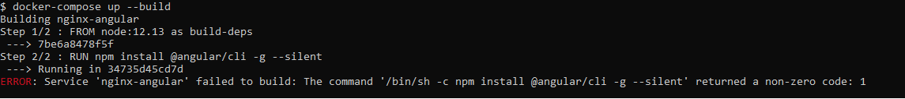

# Zscaler issues with Docker

## To replicate:

### Step 1: Ensure Zscaler is on

### Step 2: Have a fresh install of Docker

### Step 3: Build the project

Start with:

    docker-compose up --build

This should result in an error of the form:

Then, uncomment line #3 in the Dockerfile in angular-frontend.

Run again with:

    docker-compose up --build

It should now finish the build of the angular-frontend:

It will now continue to the dotnet-api Dockerfile and fail in there:

